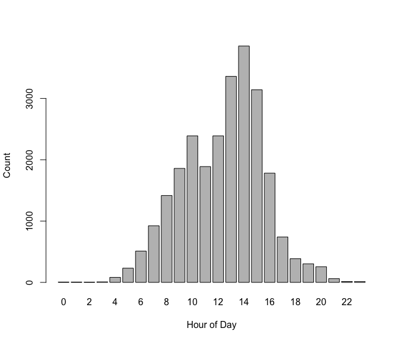
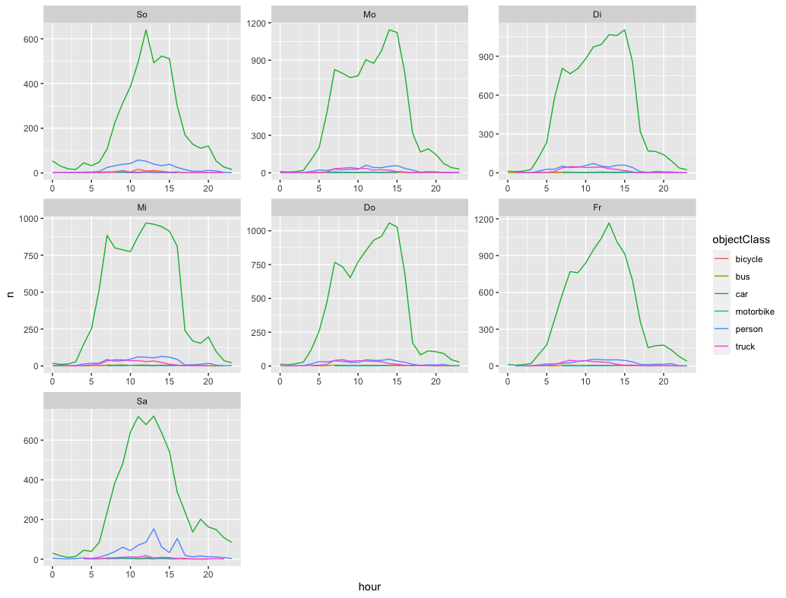

# opendatacam-statistics
 Simple statistics from [OpenDataCam](https://github.com/opendatacam/opendatacam) using R

## Prepare your R

In order to use the script you need to install the following packages:

```r
install.packages("tidyverse")
install.packages("plyr")
```

## Input Data
As a prerequisite, counter data generated by [OpenDataCam]() is expected to be placed inside the `/input` folder. Just put the  `csv` file(s) you downloaded from the data section on the web interface. It is possible to place multiple files into the `/input` folder.

### CSV format

The column structure in the `csv` file is

| Position in csv | Fieldname | Allowed values |
|--------|--------|----------|
| 1 | frameId | int |
| 2 | Timestamp |  |
| 3 | Counter ID | Name assigned to the counter (e.g. "grenze") |
| 4 | name | class of the object (e.g. "car", "truck", "person") |
| 5 | id | int |
| 6 | bearing | [0-360] Direction where the object is heading (in degree, ex: 0 degree means heading toward top of the frame, 180 towards bottom) |
| 7 | Direction | "bidirectional", "leftright_topbottom", "rightleft_bottomtop" |
| 8 | angleWithCountingLine | [0-360] |

Sample in `csv`:
```
1133,"2021-12-05T13:45:25.245Z","grenze","car",73,90.97102193107916,"rightleft_bottomtop",88.17329797295241
```

## Process data using R

We're going to import the `csv`, transform (well, basically enhance) the data by adding new variables (i.e. columns), and plot the counter statistics into a pretty chart. Use the `scripts/odc-process.R` script file in RStudio in order to generate the csv file used for plotting.
Using `scripts/odc-plot.R` you can import the csv that was produced by the processing script and generate histograms for each day of the week.

### Example for Vehicles/Hour



### Example for Vehicles/Hour grouped by objectClass



## Help me out

If you know R and have suggestions on prettier plots and graphs, please don't hesitate and send a pull request.
